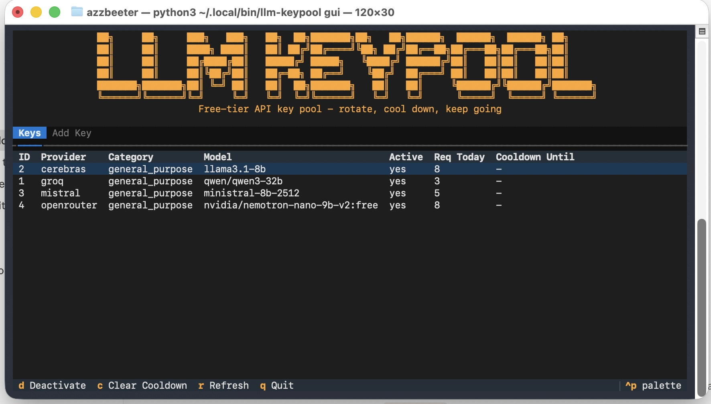
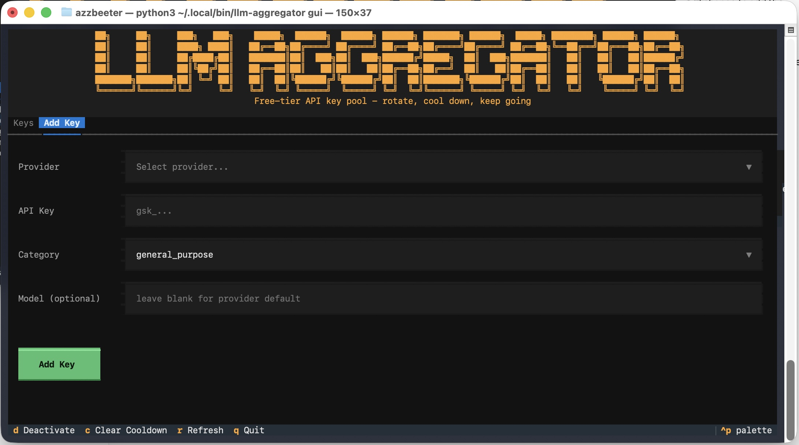

# llm-keypool

Free-tier LLM key pool manager. Register API keys from multiple providers once - llm-keypool round-robins across them, handles 429 cooldowns, and retries transparently. No paid API needed.

Exposes a CLI, a Textual TUI, and a LangChain drop-in (`AggregatorChat`).

**Roadmap:** OpenAI-compatible local proxy server (`llm-keypool proxy`) - point any agent at `http://localhost:8000/v1`, llm-keypool handles routing and rotation transparently. Session affinity ensures consistent provider within a conversation.

---

## Screenshots





---

## What it does

- **Multi-provider pooling** - pool keys across Groq, Cerebras, Mistral, OpenRouter, SambaNova, and more
- **Automatic rotation** - round-robin across keys, rotates every N requests (default: 5)
- **429 handling** - on rate limit, key enters cooldown; next call retries a different key automatically
- **Think-token stripping** - removes `<think>...</think>` from reasoning model outputs
- **Persistent state** - SQLite, WAL mode; rotation position and cooldowns survive restarts
- **LangSmith compatible** - works with LangChain tracing out of the box

Keys DB lives at: `~/.llm-keypool/keys.db`

Override path: `export LLM_KEYPOOL_DB=/custom/path/keys.db`

---

## Installation

**PyPI:** `llm-keypool`

```bash
# Recommended - with TUI
uv tool install "llm-keypool[gui]"

# Without TUI
uv tool install llm-keypool

# pip
pip install llm-keypool
```

If installing alongside mdcore (so mdcore can import it):

```bash
uv tool install --force "markdowncore-ai[gui]" --with llm-keypool
```

### Upgrading

```bash
uv tool upgrade llm-keypool
# re-add to mdcore environment too
uv tool install --force "markdowncore-ai[gui]" --with llm-keypool
```

---

## Quickstart

```bash
# Register keys (one-time)
llm-keypool add --provider groq --key gsk_... --model llama-3.3-70b-versatile --category general_purpose
llm-keypool add --provider cerebras --key csk_... --model llama-3.3-70b --category general_purpose

# Check status
llm-keypool status

# Launch TUI
llm-keypool gui
```

---

## CLI Reference

### `llm-keypool status`

Show all registered keys with cooldown and usage info.

```
llm-keypool status
```

```
 ID  Provider    Category          Model                       Active  Req Today  Cooldown Until
 1   groq        general_purpose   llama-3.3-70b-versatile     yes     42         -
 2   cerebras    general_purpose   llama-3.3-70b               yes     18         -
 3   mistral     general_purpose   mistral-small-latest        yes     0          2026-04-27T00:00:00
```

---

### `llm-keypool add`

Register an API key for a provider.

```bash
llm-keypool add --provider <provider> --key <key> [--model <model>] [--category <category>]
```

| Flag | Default | Description |
|---|---|---|
| `--model` | provider default | Override the model used for this key |
| `--category` | `general_purpose` | Key pool category |

Examples:

```bash
llm-keypool add --provider groq --key gsk_...          --model llama-3.3-70b-versatile --category general_purpose
llm-keypool add --provider cerebras --key csk_...      --model llama-3.3-70b           --category general_purpose
llm-keypool add --provider mistral --key sk_...        --model mistral-small-latest     --category general_purpose
llm-keypool add --provider openrouter --key sk-or-...  --model meta-llama/llama-3.3-70b-instruct:free --category general_purpose
```

---

### `llm-keypool deactivate`

Deactivate a revoked or expired key. Does not delete it.

```bash
llm-keypool deactivate --id 3
```

---

### `llm-keypool clear-cooldown`

Manually clear a key's cooldown after you've confirmed the quota has reset.

```bash
llm-keypool clear-cooldown --id 2
```

---

### `llm-keypool providers`

List all supported providers, their categories, default models, and OpenAI compatibility.

```bash
llm-keypool providers
```

---

### `llm-keypool gui`

Launch the Textual TUI. Requires `[gui]` extra.

```bash
llm-keypool gui
```

Features: tabular key view, inline deactivate/clear-cooldown, add key form.

---

## Registering keys - free tier providers

All providers below have a free tier. No credit card required.

| Provider | Suggested model | Signup |
|---|---|---|
| Groq | `llama-3.3-70b-versatile` | https://console.groq.com/keys |
| Cerebras | `llama-3.3-70b` | https://cloud.cerebras.ai |
| Mistral | `mistral-small-latest` | https://console.mistral.ai/api-keys |
| OpenRouter | `meta-llama/llama-3.3-70b-instruct:free` | https://openrouter.ai/settings/keys |

Full provider details and rate limits: [PROVIDER_GUIDE.md](PROVIDER_GUIDE.md)

---

## LangChain integration

`AggregatorChat` is a `BaseChatModel` drop-in:

```python
from llm_keypool import AggregatorChat

llm = AggregatorChat(
    category="general_purpose",
    max_tokens=4096,
    temperature=0.7,
    rotate_every=5,
)

response = llm.invoke("What is the capital of France?")
print(response.content)
print(response.response_metadata)
# {"provider": "groq", "model": "llama-3.3-70b-versatile", "model_name": "llama-3.3-70b-versatile", "tokens_used": 42}
```

Async:

```python
response = await llm.ainvoke("Explain async Python.")
```

Works in chains:

```python
from langchain_core.prompts import ChatPromptTemplate

chain = ChatPromptTemplate.from_template("Answer: {question}") | llm
result = chain.invoke({"question": "What is Python?"})
```

LangSmith tracing works automatically if `LANGCHAIN_TRACING_V2` and `LANGCHAIN_API_KEY` are set.

---

## LangChain embeddings integration

`AggregatorEmbeddings` is a `langchain_core.embeddings.Embeddings` drop-in backed by the embedding category keys (Jina, HuggingFace, etc.):

```python
from llm_keypool import AggregatorEmbeddings

embeddings = AggregatorEmbeddings(
    category="embedding",
    rotate_every=5,
)

# Single query
vector = embeddings.embed_query("What is Python?")

# Batch documents
vectors = embeddings.embed_documents(["doc one", "doc two", "doc three"])
```

Works as a drop-in for any LangChain vector store:

```python
from langchain_community.vectorstores import FAISS

db = FAISS.from_texts(["hello world", "foo bar"], embedding=embeddings)
results = db.similarity_search("hello")
```

---

## Direct Python usage

```python
import asyncio, json
from llm_keypool.key_store import KeyStore
from llm_keypool.rotator import Rotator
from llm_keypool.providers.dispatch import complete
from pathlib import Path

with open(Path(__file__).parent / "llm_keypool/config/providers.json") as f:
    configs = json.load(f)["providers"]

rotator = Rotator(KeyStore(), configs, rotate_every=5)

async def ask(question: str) -> str:
    result, key_data = await complete(
        rotator,
        category="general_purpose",
        messages=[{"role": "user", "content": question}],
        max_tokens=1024,
    )
    if result.error:
        raise RuntimeError(result.error)
    print(f"[{key_data['provider']} / {key_data['model']}]")
    return result.text

print(asyncio.run(ask("What is 2 + 2?")))
```

---

## Cooldown behaviour per provider

Cooldown timestamps are derived from response headers where available, so the key is released at the earliest possible moment rather than a conservative guess.

| Provider | Source | Behaviour |
|---|---|---|
| **Groq** | `x-ratelimit-reset-requests` header | Exact reset duration parsed from the header (e.g. `1m26.4s`). On 429 with `retry-after`, uses that instead. |
| **Cerebras** | `x-ratelimit-remaining-requests-{minute,hour,day}` | Tiered: minute exhausted -> 60s; hour exhausted -> 3600s; day exhausted -> next UTC midnight. |
| **Mistral** | `x-ratelimit-remaining-req-minute` | 60s rolling when per-minute quota hits zero. |
| **OpenRouter** | none (no headers returned) | Next UTC midnight (RPD is binding limit). |
| **SambaNova** | none | 65s rolling. |
| **Cohere** | none | First of next calendar month (monthly call cap). |
| **Cloudflare** | none | Next UTC midnight (daily neuron budget). |
| **Jina** | none | 65s rolling. |
| **HuggingFace** | none | 120s rolling. |

Header parsing was verified against live API responses. Providers without header support fall back to the `cooldown_fallback.strategy` field in `providers.json`, so the strategy is config-driven rather than hardcoded.

---

## Project structure

```
llm-keypool/
- llm_keypool/
  - cli.py               # Typer CLI (status, add, deactivate, clear-cooldown, providers, gui)
  - tui.py               # Textual TUI
  - key_store.py         # SQLite persistence (~/.llm-keypool/keys.db)
  - rotator.py           # round-robin rotation + cooldown logic
  - langchain_wrapper.py # AggregatorChat (BaseChatModel) + AggregatorEmbeddings
  - providers/
    - dispatch.py        # retry loop, 429 handling, provider routing
    - headers.py         # rate-limit header parsing + per-provider cooldown extraction
    - openai_compat.py   # AsyncOpenAI client + think-token stripping
    - cohere.py
    - cloudflare.py
  - config/
    - providers.json     # provider metadata, limits, models, reset schedules
- tests/
  - test_key_store.py    # KeyStore CRUD, cooldown, usage, migration
  - test_rotator.py      # rotation, 429 handling, cooldown strategies
  - test_cli.py          # CLI commands via Typer test runner
  - test_langchain_wrapper.py  # AggregatorChat + AggregatorEmbeddings mocks
- stress_test.py         # live rotation stress tester (real API calls)
- PROVIDER_GUIDE.md      # signup URLs and rate limits per provider
- TODO.md                # known limitations and planned improvements
```
